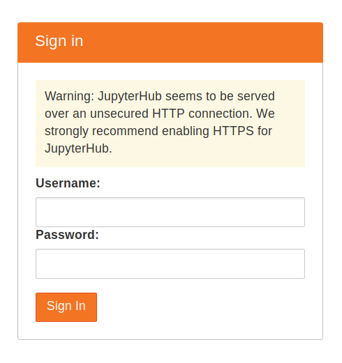
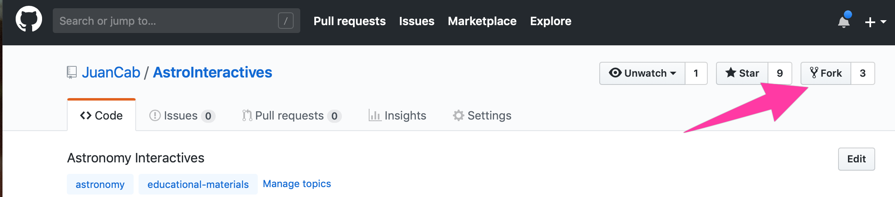
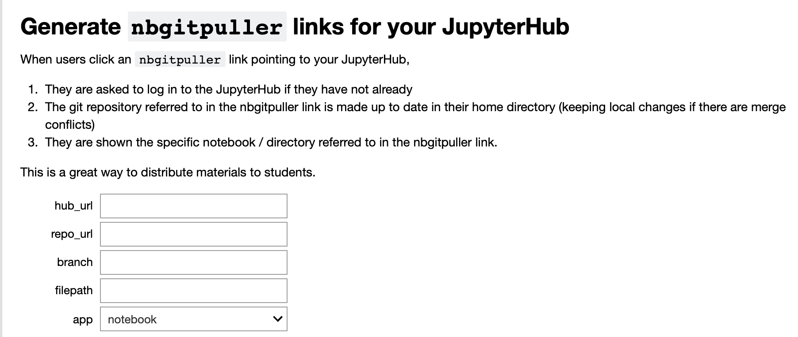

## HOWTO Set up a TLJH server for hosting AstroInteractives

**Juan Cabanela (cabanela@mnstate.edu)**

To help others who may be scared at the prospect of setting up a JupyterHub Server to allow you to run the [AstroInteractives](https://github.com/JuanCab/AstroInteractives)), I have put together this HOWTO guide.  As a warning, quite a bit of the software is in active development, so the instructions may be out of date.  I'll try to give pointers about where to check for updated instructions when you need them.

We will be using [The Littlest JupyterHub](https://github.com/jupyterhub/the-littlest-jupyterhub), a version of the JuptyerHub server meant for quick installations and relatively small loads.  We will abbreviate it throughout this document at TLJH.  TLJH currently expects to run on at least  Ubuntu 18.04 Linux. Their website has links to documentation for installing it.  I will review the installation because I didn't find actually getting it installed tricky.


### Install Ubuntu 18.04

We installed Ubuntu on a virtual machine, but the instructions should work similarly for a hardware PC.  I will use the term "PC" generically below.  We set up the PC with four 2.3 GHz CPUs, 6GB of RAM, and 20GB of hard drive space allocated.  This was necessary to run ten of our most CPU intensive interactives at the same time without too much lag.  Your set up may need different requirements depending on the expected load.

1. Boot the PC from 18.04 live server ISO with network card active.  
Follow the instructions in the installer and install Ubuntu using appropriate network and formatting settings for your machine.  This will likely be "destructive," wiping out pre-existing data on that PC and using the entire disk for the Ubuntu installation.

2. Create the admin account, keeping in mind you will install TLJH from this account.

3. Once you are done, reboot the PC (removing the installation media).
Perform all the necessary updates from the admin account command line by doing

		sudo apt-get update
		sudo apt-get upgrade

4. Confirm the necessary python, git, and curl packages are installed by doing:

		sudo apt-get install python3 git curl

### Install TLJH

Once you have your Ubuntu server, the actual installation of TLJH is performed with a single command from the command line:

1. **Running the installer**: You will likely want to look at the [TLJH documentation](https://the-littlest-jupyterhub.readthedocs.io/en/latest/install/custom-server.html) to confirm these instructions are still valid.  Assuming they are, you can issue the command (all on one line) in the terminal:

		curl https://raw.githubusercontent.com/jupyterhub/the-littlest-jupyterhub/master/bootstrap/bootstrap.py | sudo -E python3 - --admin <admin-user-name>
If everything works, after a few minutes you should see (at the end of a bunch of text output about various items being installed and downloaded) the phrase ``Done!``

3. **Testing the Installation:** At this point, you could copy the Public IP of your server, and try accessing ``http://<public-ip>`` from your browser. If it worked, you should get a JupyterHub login prompt like the one shown here, including the warning that you want to enable HTTPS so that connections to your server are encrypted.


3. You can enable https using the Let's Encrypt service.  However, before you can attempt that you MUST give your server a publicly visible domain name and it can't have its port 80 or 443 blocked by a firewall. Once you are certain that the TLJH server is visible to the outside world, the following commands should allow TLJH to negotiate with Let's Encrypt to get you a proper security certificate and enable encrypted connections to your server (and disable un-encrypted one).

		sudo -E tljh-config set https.enabled true
		sudo -E tljh-config set https.letsencrypt.email <admin_email>
		sudo -E tljh-config add-item https.letsencrypt.domains <DNS_name_of_server>
		sudo -E tljh-config show
		sudo -E tljh-config reload proxy
If this fails, just do the following to reenable un-encrypted server connections.

		sudo -E tljh-config set https.enabled true
		sudo -E tljh-config reload proxy
More detailed instructions for enabling encryption are on [the TLJH documentation site](https://the-littlest-jupyterhub.readthedocs.io/en/latest/howto/admin/https.html)

### Configuring TLJH for AstroInteractives

1. **Setting up JupyterHub accounts:**  If you point your browsers to ``https://<public-ip>`` you can now log in.  If you login using the admin user name you used previously, you can choose any password that you wish. Use a strong password & note it down somewhere, since this will be the password for the admin user account from now on.

	* At this point, you can use the JupyterHub interface to set up user accounts.  Go to the [TLJH server installation instructions](https://the-littlest-jupyterhub.readthedocs.io/en/latest/install/custom-server.html) and look at Step 2 onward.  You will also notice that you can select a terminal from the "New" menu, which opens a terminal in your web browser.  You can use this to maintain or update your server at this point, it is almost equivalent to the terminal from the console.
	* **WARNING:** The default setup is to use FirstUseAuthentication approach to authentication.  This means the first time someone enters a new username, the password they enter becomes their JupyterHub password. It creates a system account with username ``jupyter-<username>`` and a home directory at ``/home/jupyter-<username>``.  The system password on that account is left unset so remote logins are disabled (however, Jupyter offers within it a terminal function, so using this approach means anyone can get user-level terminal access to your server).   There are instructions online to [change authentication methods to other, more secure means](https://the-littlest-jupyterhub.readthedocs.io/en/latest/topic/authenticator-configuration.html#topic-authenticator-configuration).

2. **Installing the necessary Python Libraries:** The next step is to set up the default anaconda environment to include the necessary libraries to run AstroInteractives. From the admin account, open a terminal and from the command line, add ``conda-forge``` as a location to pull python packages from, then install the necessary python packages:

		sudo -E conda config --add channels conda-forge
		sudo -E conda install appmode bqplot pandas scipy ipywidgets numpy pythreejs

3. **Shut Down Existing Servers:** At this point, you will need to shut down any existing JupyterHub server processes (via the web browser admin interface) to make sure these new libraries are available.  To do this:
Log into your THJH via the web interface
	* Click on the "Control Panel" button in the upper right.
	* Click on the Admin menu item and on that page just "Stop All" servers.
	
4. **Creating your own copy of AstroInteractives:** At this point, I strongly recommend you log into GitHub and fork the AstroInteractives code.  This will create a copy of the code in your own repository on GitHub that you can then modify to suit your own needs.  To do this:
	* Make sure you have [GitHub](https://github.com/) account, log into it.
	* Go to [https://github.com/JuanCab/AstroInteractives](https://github.com/JuanCab/AstroInteractives)
	* As shown above, click the "Fork" button in the upper right to create a cloned copy of the AstroInteractives repository in your account.  
	
4. **Installing AstroInteractives in your own account to test it:** Then, from your admin account, use the terminal to clone the repository to your account:

		git clone https://github.com/<your_github_account>/AstroInteractives.git
		
5. **Killing old processes:**  Unfortunately, we have discovered that in the current version of TLJH, there is no automatic shutdown of old JupyterHub processes.  If students don't explicitly log out, their process sits there and if a few dozen of these processes remain in memory, they can bog down the server and consume resources.  Our solution was to add a cronjob using 'sudo crontab -e' to issue a ``killall -p jupyterhub-singleuser`` at 8:00am each morning by adding the line

		0 8 * * * killall -p jupyterhub-singleuser
to the cronjob list.  That has worked for us.

6. **Customizing the interface**: If you want to disable the ability for your students to easily access the control panel or terminal, you can copy the [custom.css](media/custom.css) file to the following location on your server: ``/etc/skel/.jupyter/custom/custom.css`` Once you have done so, any *NEW* users will have this custom CSS copied to their account during their first login, disabling those features.  This really isn't helpful for security, but it does help prevent students accidentally killing their JupyterHub process.

7. **Setting up Automatic download of notebooks and Automatic launching**: At this point, when a user logs in they will just get a blank account.  However, TLJH has the [*nbgitpuller* extension installed](https://the-littlest-jupyterhub.readthedocs.io/en/latest/howto/content/nbgitpuller.html), which allows you to configure a link to automatically perform a git pull of the latest version of your repository.  This will install/update the software to the latest version in the student's account.  With some tweaking, we can also take advantage of the *appmode** extension we installed so that we can automatically update the software.
	* Use this [Binder page](https://mybinder.org/v2/gh/jupyterhub/nbgitpuller/master?urlpath=apps/binder%2Flink_generator.ipynb) to generate the appropriate URL to give your students.  It may take a few minutes for the Binder session to launch. Once you see the page which looks like what is shown here. 
	* On that page, fill in the fields:
		* ``hub_url`` is the url of your JupyterHub Server
		* ``repo_url`` is the url for your GitHub repository
		* ``filepath`` is ``index.ipynb``, the name of the index notebook.
		* At this point, you can test the link and see if it has the desired effect of downloading and updating the copy of your GitHub repository.

	* Once you have generated the link, change it as follows to trigger *appmode*.  The link you generated should look like 
``https://<my_TLJH_server>/hub/user-redirect/git-pull?repo=<repo_URL_encoded>&subPath=index.ipynb&app=notebook``
To automatically trigger *appmode*, replace ``subPath=index.ipynb`` with ``urlpath=apps/AstroInteractives/index.ipynb`` so it looks like
``https://<my_TLJH_server>/hub/user-redirect/git-pull?repo=<repo_URL_encoded>&urlpath=apps/AstroInteractives/index.ipynb&app=notebook``
Please note that the part between ``apps`` and ``index.ipynb`` depends on the name of your repo, because by default a git pull creates a directory with the same name as your repository.  I assumed you named it ``AstroInteractives``.  Finally, I used [bit.ly](https://bitly.com) to generate a much shorter URL that I give my students.

